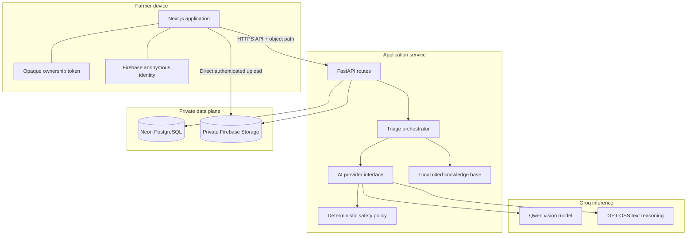
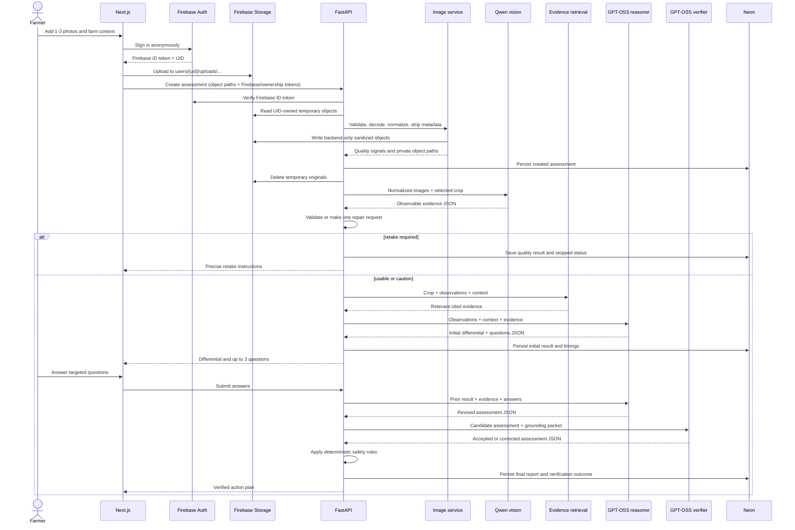

# ShambaLens AI Architecture

## Design goals

ShambaLens is structured around four constraints:

1. **Evidence before labels.** Image models may describe what is visible, but diagnostic ranking happens only after observations are validated and grounded in crop evidence.
2. **Uncertainty stays visible.** Each hypothesis carries support, contradiction, missing information, and a bounded confidence value.
3. **Verification changes outcomes.** The verifier is a separate call whose corrections are applied before deterministic safety rules and persistence.
4. **Farmer data remains scoped.** Reports and images are private to an opaque browser token; public analytics contain only coarse completed-report aggregates.

## System context



Only the backend can read sanitized assessment objects, reach Neon, and call Groq. The browser may create or delete temporary objects only beneath its Firebase UID-scoped upload path. Firebase web identifiers are public application configuration; Firebase Admin credentials and model/database secrets remain backend-only.

## Components

| Component | Responsibility | Trust notes |
| --- | --- | --- |
| Next.js frontend | Direct Firebase upload, context wizard, questions, reports, previous reports, dashboard, English/Swahili UI, print and copy actions | Holds an opaque report token and Firebase anonymous identity, never service credentials |
| FastAPI routes | Versioned transport, Firebase ID-token/object ownership checks, local multipart fallback, safe errors, request IDs, CORS | The only public entry to private application data |
| Image service | Firebase/local storage adapter, signature/type checks, byte and pixel limits, decode, blur/lighting signals, RGB normalization, metadata removal, generated object paths | Never fetches arbitrary URLs or trusts filename/MIME/size claims |
| Triage orchestrator | Enforces stage order, short-circuits retakes, validates every model result, records timings | Demo fixtures are selected explicitly and never used as a live fallback |
| AI provider interface | Vision observation, initial reasoning, answer revision, and independent verification | Applies timeouts, maps provider errors, and performs at most one JSON repair attempt |
| Evidence retrieval | Ranks local entries by crop, observations, and context and returns citations | Small, reviewable corpus; no claim of exhaustiveness |
| Safety policy | Detects or removes dosage, mixture, restricted-product, or disproportionate instructions | Always runs after model verification |
| SQLAlchemy repository | Assessment lifecycle, model/timing metadata, anonymous ownership filtering, dashboard queries | Uses pooled Neon connections for application traffic |
| Alembic | Versioned schema migration | Uses the direct Neon connection where configured |
| Private Firebase Storage | Temporary UID-scoped originals and backend-only sanitized objects | Rules deny public reads; Neon stores object paths rather than permanent download URLs |

## End-to-end assessment flow



## Stage contracts

### 1. File and image gate

Before model inference, the service enforces:

- one to three images;
- allowed decoded formats: JPEG, PNG, and WebP;
- configured per-file byte and decompressed-pixel ceilings;
- a valid signature and successful Pillow decode;
- generated storage names and path containment;
- RGB re-encoding, a bounded pixel count, and metadata stripping;
- deterministic blur and lighting signals.

These local checks reject malformed, oversized, decompression-bomb, or unsupported input without consuming inference quota.

### 2. Vision observation

The vision model is asked for only observable properties: plant visibility, selected-crop relevance, affected-area visibility, image quality, retake instructions, and symptom descriptions. It is not asked to expose private reasoning. The Pydantic contract rejects unknown/missing fields and out-of-range values.

The combined gate returns one of:

- `good`: continue normally;
- `caution`: continue while preserving quality limitations in uncertainty;
- `retake_required`: stop before diagnostic reasoning.

### 3. Evidence retrieval

The retrieval service filters first by crop, then scores entries using normalized symptoms and farmer context. Returned records include problem/category, discriminating features, low-risk actions, escalation signs, source organization/title, and a reference. Retrieval is deterministic and testable even when Groq is unavailable.

### 4. Initial reasoning and questions

GPT-OSS receives text only:

- normalized vision observations;
- crop and farmer-supplied context;
- selected evidence records; and
- the requested output language.

It returns one to three ranked hypotheses with supporting, contradicting, and missing evidence, severity, confidence, urgency, uncertainty, and up to three questions. Question objects identify answer controls and the named possibilities they distinguish. Internal question-selection reasoning is not returned to the farmer.

### 5. Revision

The answers request references only questions issued for that assessment. The revision stage updates rankings and actions, states what changed in concise evidence terms, and identifies the answer with the greatest effect. It must not manufacture new image observations.

### 6. Verification and safety

The verifier is a distinct GPT-OSS request with a verifier-specific system instruction and strict output contract. It checks:

- conclusions are supported by observations and retrieved evidence;
- contradictory and missing evidence remains represented;
- confidence is proportionate to input quality and agreement;
- urgency and escalation match the reported severity;
- actions are low-risk and understandable;
- prohibited chemical guidance is absent;
- farmer-facing language matches the requested English or Swahili mode.

The verifier can accept, lower confidence, add uncertainty/escalation, or return a corrected candidate. The application stores the verifier outcome separately from the final assessment. A conservative deterministic policy scans every action section and expert-guidance text, then removes prohibited chemical, mixture, or dosage instructions and inserts safe professional-escalation guidance where needed. A `verified` badge therefore represents an executed stage, not a decorative label.

## Structured output rules

All model-facing contracts are Pydantic models with closed JSON-schema objects. The provider sends strict schema mode where supported and JSON-object mode for vision observation. Optional concepts are represented by required nullable fields when a provider's strict schema requires it.

Application invariants include:

- confidence is in `[0, 1]`;
- each differential contains one to three hypotheses;
- there are no more than three follow-up questions;
- question identifiers and answer options are stable;
- action-plan and uncertainty fields are present;
- unvalidated provider output never reaches persistence or the frontend.

A malformed response receives one repair call containing validation feedback but no secrets. A second failure becomes a standardized, retryable provider error. Empty responses, rate limits, and timeouts never trigger demo fixtures in live mode.

## Provider abstraction

The orchestration layer depends on capabilities rather than a vendor client:

```text
observe_images(images, crop, language) -> ImageObservation
create_initial(observations, context, evidence) -> InitialAssessment
revise(initial, answers, evidence) -> FinalAssessment
verify(candidate, grounding_packet) -> VerificationResult
```

The Groq implementation owns authentication, endpoint construction, model identifiers, timeouts, response parsing, strict-schema options, and safe error mapping. This keeps route handlers and domain tests independent of provider transport.

Qwen is the image-observation capability. GPT-OSS performs text-only initial reasoning, revision, and the independent verification call. Model identifiers are configuration, recorded as provenance, and exposed by the runtime endpoint without exposing the key.

## Demo/live isolation

`DEMO_MODE=true` swaps the provider implementation for deterministic, named fixtures:

- tomato leaf spots;
- onion leaf discoloration;
- kale pest damage.

Fixtures still pass through schema validation, repository persistence, ownership checks, and presentation logic. Their responses and reports are visibly marked simulated. When `DEMO_MODE=false`, a provider failure returns an application error and retry affordance; it cannot enter the fixture path.

## Persistence

The initial Alembic migration creates an `assessments` table with:

- UUID assessment ID, status, creation/update/completion times;
- token hash;
- crop, growth stage, coarse optional region, symptom duration, watering, notes, and language;
- demo scenario and generated image metadata;
- image-quality result, initial assessment, answers, final assessment, and verification result;
- provider/model provenance and per-stage timing metadata.

Structured results are stored as validated JSON documents so the report can be reopened without repeating paid inference. Indexes support creation-time listing and ownership-token filtering.

### Neon connections

`DATABASE_URL` is the pooled Neon URL for API transactions. `DATABASE_URL_UNPOOLED` is the direct URL for Alembic. Both remain backend secrets and retain Neon-provided TLS parameters. The local Compose profile fills both values with a development PostgreSQL URL when they are blank.

The application does not need a Neon management API key. Automated tests use an isolated local PostgreSQL database or transaction fixtures rather than a shared live branch.

### Image lifecycle

The database stores generated Firebase object-path metadata, not image bytes or permanent download URLs. Security Rules permit an authenticated browser to create and clean up only temporary objects under its own UID. FastAPI verifies the same Firebase identity before accepting a path, re-validates the actual stored bytes, writes a metadata-free JPEG to an Admin-only assessment path, and deletes the original. Clients retrieve sanitized images through a route that re-checks the assessment ownership token and streams the object. Community aggregation never joins or returns image paths.

Local development and deterministic tests retain a filesystem adapter behind the same internal metadata contract. Neither adapter changes the public report representation.

## Anonymous ownership

On first use, the browser creates or receives a high-entropy opaque token and supplies it on assessment requests. The backend hashes the token with `ANONYMOUS_TOKEN_SALT` and stores only the hash. List, detail, answer, reset, and image operations constrain queries by both assessment ID and token hash.

This protects casual cross-browser access but is not full identity authentication. Tokens can be lost with browser storage, cannot synchronize devices, and should not authorize organizational workflows. Those use cases require real accounts and role-based access.

## Community-signal aggregation

Only completed reports can contribute. Queries group into coarse buckets such as week, crop, optional county/region, leading suspected category, and urgency. The endpoint returns counts and summaries, never record-level rows, notes, answers, timestamps precise enough to identify a farmer, images, or tokens.

Every dashboard view carries: **Community-reported AI signals, not confirmed outbreak data.** Live mode suppresses crop, category, urgency, and county buckets with fewer than three reports; demo fixtures remain visible but explicitly simulated.

## Error and observability model

Every application error is normalized:

```json
{
  "error": {
    "code": "provider_timeout",
    "message": "The analysis service did not respond in time. Please retry.",
    "retryable": true,
    "request_id": "..."
  }
}
```

Structured logs use the request ID, route, status, assessment ID where safe, stage name, duration, provider/model identifier, and exception class. Logs exclude credentials, ownership tokens, image contents, raw model payloads, and farmer descriptions.

`GET /api/v1/system/runtime` returns non-sensitive configuration and recorded stage latencies. It does not infer, invent, or advertise hardware characteristics.

## Security boundaries

| Boundary | Threat | Control |
| --- | --- | --- |
| Browser to Firebase/API | Oversized/mislabelled file, foreign object path, unauthorized report access | Firebase anonymous auth, UID-scoped rules, App Check, server-side byte/pixel/decode checks, token-hash query scope |
| API to Groq | Secret leakage, prompt injection through notes, malformed output | Backend-only key, delimited input, constrained task prompts, strict schema, validation, bounded repair |
| API to Neon | Credential exposure, cross-owner query | Secret manager, TLS URL, repository ownership filters, least-privileged application role |
| API to Firebase Storage | Executable upload, public enumeration, permanent URL leakage | Admin-only sanitized paths, decode/re-encode, metadata removal, stored object keys instead of download URLs, protected route |
| Reports to dashboard | Farmer re-identification | Completed-only coarse aggregation, no record rows/images/tokens, explicit signal disclaimer |
| Model result to farmer | Unsafe action or false certainty | Differential contract, verifier call, confidence calibration, deterministic action guardrails |

Additional production controls belong at the deployment edge: HTTPS, rate limiting, request-body ceilings, network restrictions, secret rotation, database backup/retention, malware monitoring where policy requires it, and alerting on repeated provider or validation failures.

## Scaling and extension points

- Add a crop by adding reviewed knowledge entries, crop/schema values, translations, demo/test cases, and retrieval evaluation—not by changing provider transport.
- Add a model provider by implementing the four capability methods and provider error mapping.
- Add another object-storage provider by implementing the storage adapter while preserving generated identifiers, server-side normalization, and protected retrieval.
- Add authenticated organizations above the existing ownership-aware repository rather than exposing raw assessment queries.
- Improve outbreak intelligence only with opt-in governance, minimum bucket sizes, and human confirmation.
- Evaluate calibration using agronomist-reviewed cases before mapping confidence labels to operational decisions.
